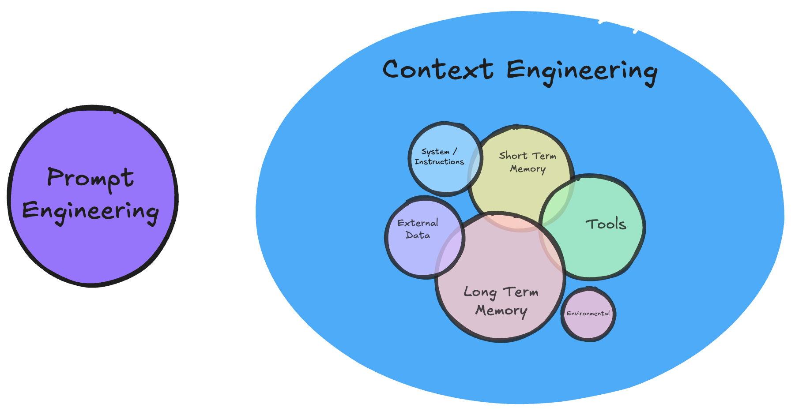
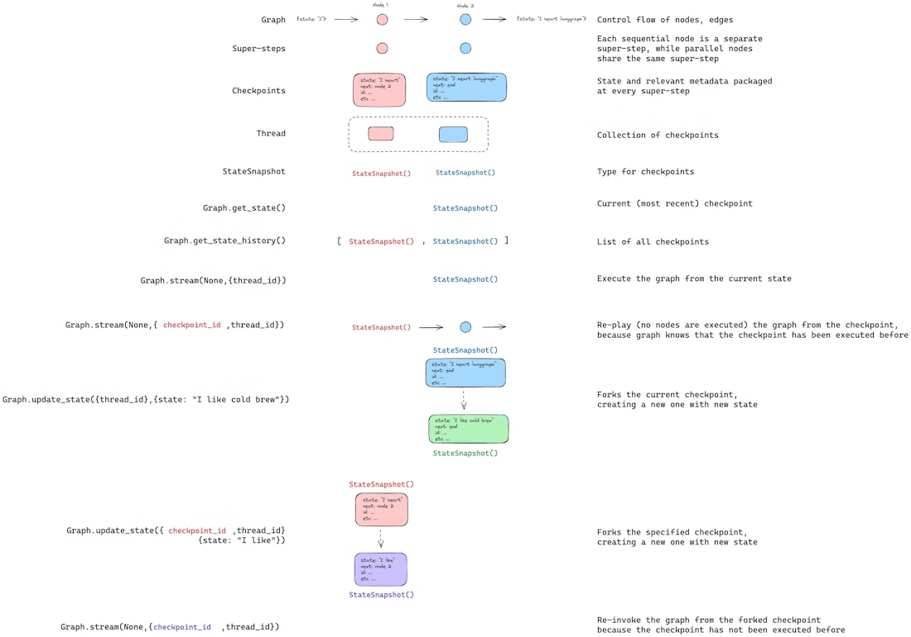

# Overview
**⭐️ This repo builds from the basics of LangGraph to complex long term memory concepts and deep agents.**
- `langgraph` contains fundamental concepts of langgraph graphs including ST memory, interrupts & streaming
- `long-term-memory` contains implementations of LT memory for self-improvement
- `deep-agent` contains my implementation of a deep agent capable of running autonomously for 30+ minutes, with it's own folder path and self-improvement mechanisms (this is the cool bit!)
- `ibm-talk.ppt` is the slide deck explaining the theory

## 🤖 What Are Deep Agents?
- Deep agents (think Claude Code, Deep Research, Manus) use planning tools, have their own file system and can spawn sub-agents to work on long time-horizon tasks...
- Ever wondered how Deep Research agents can execute 100's of tool calls without getting lost along the way whilst simple ReACT agents get lost of 7-8 steps? Deep agent harnesses are how!
- Deep agents are SOTA on AGI benchmarks

## 🧠 What is Long Term Memory?
- Long-term memory is everything an agent saves across sessions from past interactions, so it can use previous experiences and knowledge to guide future behaviour instead of “forgetting” each time.
- It includes episodic memories (what happened and what worked), semantic memories (facts like names and preferences), and procedural memories (how the agent itself operates, via its code or updated system prompt).

## 👨‍💻 What is LangGraph
- LangGraph is a framework for orchestrating AI agents as graphs of nodes, letting you control step-by-step flow, add tools, plug in memory, handle failures, and add human-in-the-loop.

